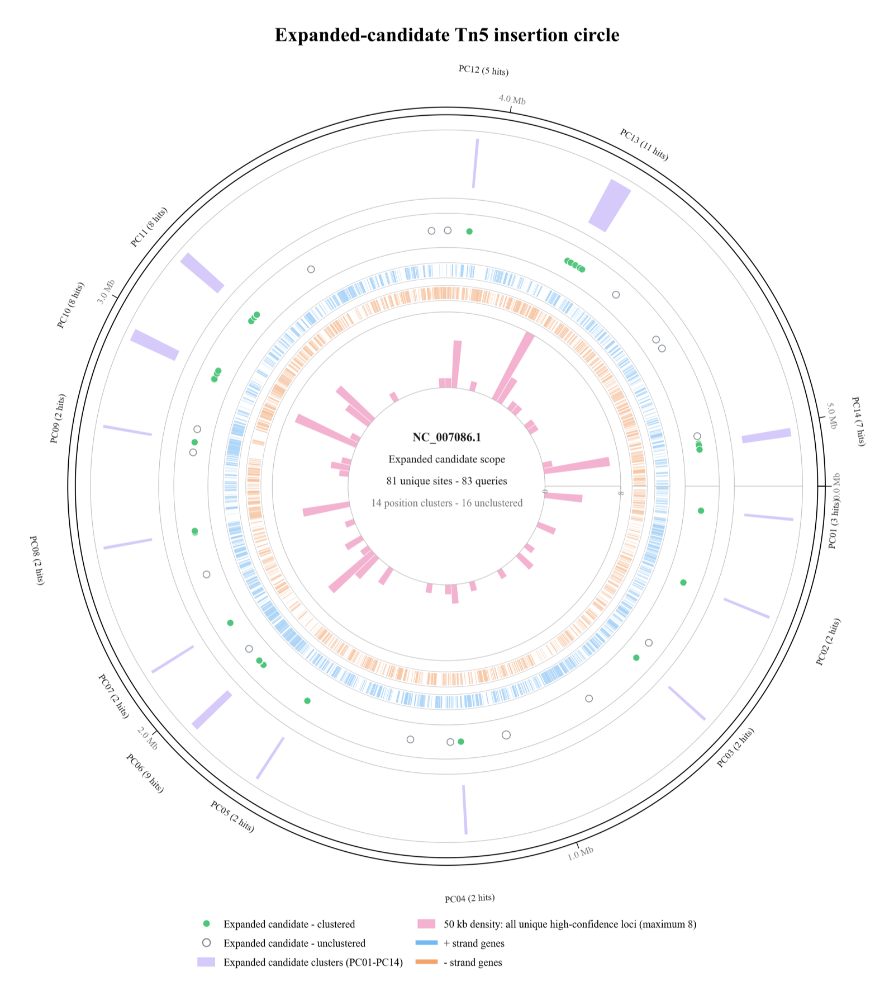

# Tn5cope

**English** | [中文](README_CN.md)

> Clear signals, careful calls.

**Tn5cope** is a Tn5 insertion-site analysis tool for Tail-PCR/Sanger sequences.
It conservatively locates Tn5–genome junctions, annotates whether each insertion
falls within a gene or an intergenic region, and produces candidate-gene calls,
positional clusters, functional clusters, and circular genome plots.

The repository includes a fully synthetic example dataset. Use it to confirm that
your installation works before switching to your own files.

> [!IMPORTANT]
> All inputs under`examples/` are synthetic teaching data and must not be used to draw
> biological conclusions. The figure below is a derived visualization included
> only to demonstrate the expected output; it contains no raw sequence data.

<p align="center">
  
</p>
<p align="center"><em>Representative Tn5cope output from a completed analysis.</em></p>

## What it does

- Searches both the query sequence and its reverse complement for reliable
  genomic placements.
- Detects the Tn5 mosaic end and defines the insertion coordinate as the
  reference base adjacent to the Tn5–genome junction.
- Classifies each insertion as `CDS`, `gene_non_CDS`, or `intergenic`.
- Ranks candidate genes for intergenic insertions using strand, distance, operon
  context, and evidence from the Tn5 construct.
- Reports failed, low-confidence, and multiple-hit cases separately instead of
  forcing a convenient-looking answer.
- Produces traceable TSV and Excel outputs, positional and functional clusters,
  heatmaps, and circular genome plots.

Tn5cope is designed to map Tail-PCR/Sanger insertion sites from individual
mutants. It is **not** a tool for Tn-seq abundance analysis, gene-essentiality
inference, enrichment significance testing, or proof of phenotypic causality.

## First run: start with the synthetic example

### 1. Set up Python

Python 3.9 or later is required. Check your version in a terminal:

```bash
python3 --version
```

If the command reports `Python 3.9` or later, you can continue. On Windows, the
command may be `python --version`.

### 2. Enter the project directory and create an isolated environment

In a macOS/Linux terminal:

```bash
cd /path/to/Tn5cope
python3 -m venv .venv
source .venv/bin/activate
python -m pip install --upgrade pip
python -m pip install -e .
```

In Windows PowerShell:

```powershell
cd C:\path\to\Tn5cope
python -m venv .venv
.\.venv\Scripts\Activate.ps1
python -m pip install --upgrade pip
python -m pip install -e .
```

If `(.venv)` appears at the beginning of the command prompt, the environment is
usually active.

### 3. Run the tutorial example

All files below are located in [`examples/demo`](examples/demo) and contain no
real experimental data:

```bash
tn5cope \
  --query-csv examples/demo/query.csv \
  --genome-fasta examples/demo/reference.fna \
  --gtf examples/demo/reference.gtf \
  --operon-tsv examples/demo/operons.tsv \
  --aligner internal \
  --output-dir demo_output \
  --output-prefix demo
```

Windows PowerShell users can enter the command on a single line. When the run
finishes, open the newly created `demo_output/` directory and inspect these files:

- `demo_main_results.tsv`: mapping and annotation results for each query;
- `demo_failed_or_ambiguous_hits.tsv`: queries without a reliable placement;
- `demo.xlsx`: a multi-sheet workbook designed for review in Excel;
- `demo_genome_circle_plot.png`: the circular insertion-position plot.

If these files are present, the installation and basic workflow are working.
`demo_output/` is excluded by `.gitignore` and will not be uploaded.

## Prepare your input files

A production run requires three files, plus one optional file:

| File | Required? | Purpose |
|---|---|---|
| query CSV | Yes | Tail-PCR/Sanger sequences to be mapped |
| reference FASTA | Yes | Reference genome matching the experimental strain |
| reference GTF | Yes | Gene/CDS annotation from the same reference version as the FASTA |
| operon TSV | Optional | Known or externally predicted operon relationships |

The safest approach is to keep real files outside the repository—for example, in
a separate `private_input/` directory—and supply their full paths in the command.
Do not overwrite the files under `examples/` with real data.

### 1. Query CSV

A single-column CSV is recommended. Write `sequence` in the first row, followed
by one sequence per row:

```csv
sequence
CTGTCTCTTATACACATCTACGTTGCAAGTCCGATGCTAACGGTTCAGATC
GGAACCTTAGCGTTCGATACCGTTAAGCTGACCTAGTCCGAT
```

Requirements and important notes:

- The first column contains the sequence. The current CLI does not read a sample
  name column; it assigns IDs in order as `Q001`, `Q002`, and so on.
- A header is recommended, although files without one are also accepted.
- Uppercase and lowercase input are both accepted, and whitespace is removed.
  Using only `A/C/G/T/N` is recommended.
- A sequence may contain a complete or partial Tn5 mosaic end, or only the
  genomic flank.
- If no Tn5 motif is detected, the program treats the **first base** of the input
  sequence as the insertion-proximal end. You must therefore confirm that the
  exported Sanger sequence is oriented consistently with your experimental
  design.
- After Tn5 trimming, the alignable flank must be at least 20 bp long. For real
  data, provide a longer high-quality sequence whenever possible.

[`examples/demo/query.csv`](examples/demo/query.csv) is a synthetic template that
you can open directly.

### 2. Reference FASTA

The first FASTA line begins with `>`, followed by the reference sequence:

```fasta
>chromosome_name
ACGTTGCAAGTCCGATGCTAACGGTTCAGATCGTACGACT...
```

The current main workflow is designed for a **single contig or chromosome**. A
multi-contig FASTA will raise an error; do not simply concatenate contigs. The
identifier before the first space in the FASTA header—for example,
`chromosome_name`—must exactly match the first column of the GTF.

### 3. Reference GTF

A GTF is a nine-column, tab-delimited file. Tn5cope requires at least `gene` and
`CDS` records:

```text
chromosome_name  source  gene  101  900  .  +  .  gene_id "GENE001"; gene "demoA"; locus_tag "LOC_0001";
chromosome_name  source  CDS   101  900  .  +  0  gene_id "GENE001"; gene "demoA"; locus_tag "LOC_0001"; product "example protein";
```

Spaces are used above only for readability; the nine columns in the actual file
must be separated by tabs. Check the following carefully:

- The GTF and FASTA come from the same reference version.
- The first GTF column matches the FASTA sequence identifier.
- Coordinates are valid integers, and strand values are `+` or `-`.
- Attributes should include `gene_id`, `locus_tag`, `gene`, and `product`
  whenever available.
- Ontology/GO information is not required for mapping, but it affects the
  interpretability of functional clustering.

### 4. Operon TSV (optional)

If reliable operon annotations are available, provide a tab-delimited file:

```tsv
operon_id	locus_tag	gene_name
OP001	LOC_0001	demoA
OP001	LOC_0002	demoB
```

The file must contain `operon_id` and at least one gene-identifier column:
`locus_tag`, `gene_id`, `gene_code`, `gene_name`, or `gene`. If no reliable
annotation is available, omit `--operon-tsv`. The program will not declare two
adjacent genes to be in the same operon without supporting annotation.

## Run your own data

Replace the paths below with paths to your real files:

```bash
tn5cope \
  --query-csv /path/to/private_input/query.csv \
  --genome-fasta /path/to/private_input/reference.fna \
  --gtf /path/to/private_input/reference.gtf \
  --tn5-structure-profile unknown \
  --output-dir /path/to/private_output \
  --output-prefix tn5cope_run
```

`--aligner auto` searches first for minimap2, BLASTn, or BWA. If none is
available, it uses the built-in reproducible fallback. The tutorial example can
use `--aligner internal`; for production data, installing at least one mature
aligner such as minimap2 is recommended. macOS/Homebrew users can run:

```bash
brew install minimap2 blast bwa
```

These aligners are system programs and are not installed automatically by
`pip install`. You can also select one explicitly with `--aligner minimap2`,
`--aligner blastn`, `--aligner bwa`, or `--aligner internal`.

If the structure of the actual Tn5 construct is uncertain, keep
`--tn5-structure-profile unknown`. Select another profile only when the construct
map clearly demonstrates the presence of an outward-facing promoter or a
transcriptional terminator; this option changes the ranking of intergenic
candidate genes.

## How to interpret the main outputs

- `*_main_results.tsv`: final insertion coordinates, mapping-confidence status,
  and direct gene annotations.
- `*_raw_matches.tsv`: the evidence supporting candidate placements. Here,
  “raw” means **unaggregated alignment records**, not raw Sanger sequences.
- `*_failed_or_ambiguous_hits.tsv`: no-hit, low-confidence, and ambiguous cases.
- `*_expanded_gene_events.tsv`: query–gene events in the formal Expanded
  candidate scope.
- `*_expanded_candidate_exclusions.tsv`: events excluded from the Expanded scope
  and the corresponding reasons.
- `*_expanded_functional_cluster_*.tsv`: functional-cluster members and feature
  summaries.
- `*_position_cluster_*.tsv`: circular DBSCAN results for all high-confidence
  positions.
- `*_expanded_position_cluster_*.tsv`: positional clusters within the Expanded
  candidate scope.
- `*_genome_circle_plot.png/.pdf/.svg`: circular genome plots.
- `*.xlsx`: a multi-sheet workbook intended for manual review.

`Insertion site` is the 1-based reference base directly adjacent to the
Tn5–genome junction. `Junction_boundary_0based` is the 0-based boundary between
two reference bases. `Feature_relation` describes where the insertion itself
falls; the `Candidate ...` columns contain preliminary inferences based on
strand, distance, and available annotations. Do not treat these two types of
information as equivalent.

Functional clusters represent similarities among existing annotations, while
positional clusters are operational groupings produced under specified DBSCAN
parameters. Neither constitutes enrichment significance or proof of causality.
Candidate genes still require validation by genome-specific PCR/Sanger
sequencing, complementation, targeted mutagenesis, or expression experiments.

## Optional local web interface

If you are not comfortable with the command line, install the local web-interface
dependencies:

```bash
python -m pip install -e ".[web]"
tn5cope-web
```

Open <http://127.0.0.1:8000> in a browser. The web interface still runs entirely
on your own computer. Uploaded files are temporarily stored under `runs/` in the
repository. Git will not upload that directory, but the files are not encrypted
automatically; handle them according to your laboratory's data-management
policies after use.

## Troubleshooting

### `tn5cope: command not found`

The virtual environment is usually not active. Return to the project directory
and run `source .venv/bin/activate`; in Windows PowerShell, use
`.\.venv\Scripts\Activate.ps1`.

### Most sequences are reported as `no_hit`

First check the reference strain/version, the orientation of the query's
insertion-proximal end, flank length, and Sanger quality. Then inspect
`*_raw_matches.tsv` and `*_failed_or_ambiguous_hits.tsv`. Do not force placements
merely by relaxing the thresholds.

### The GTF contains genes, but no annotations appear in the results

The most common causes are a mismatch between the FASTA header and the first GTF
column, or the absence of `gene`/`CDS` records in the GTF.

### Can Tn5cope analyze a multi-contig assembly?

Not in the current production workflow. Do not concatenate multiple contigs into
a synthetic chromosome; doing so creates incorrect coordinates and circular
distances.

## Data privacy

Keep real inputs and outputs outside the cloned repository. The included
`.gitignore` blocks common sequence, reference, and result formats from ordinary
Git staging, but it is not encryption and does not protect files added manually.
Only the synthetic templates under `examples/` are intended for version control.

## License

Tn5cope is open-source software released under the [MIT License](LICENSE). You
may use, modify, and distribute this project, provided that you retain the
original copyright and license notice. The software is provided as-is, without
any warranty.
